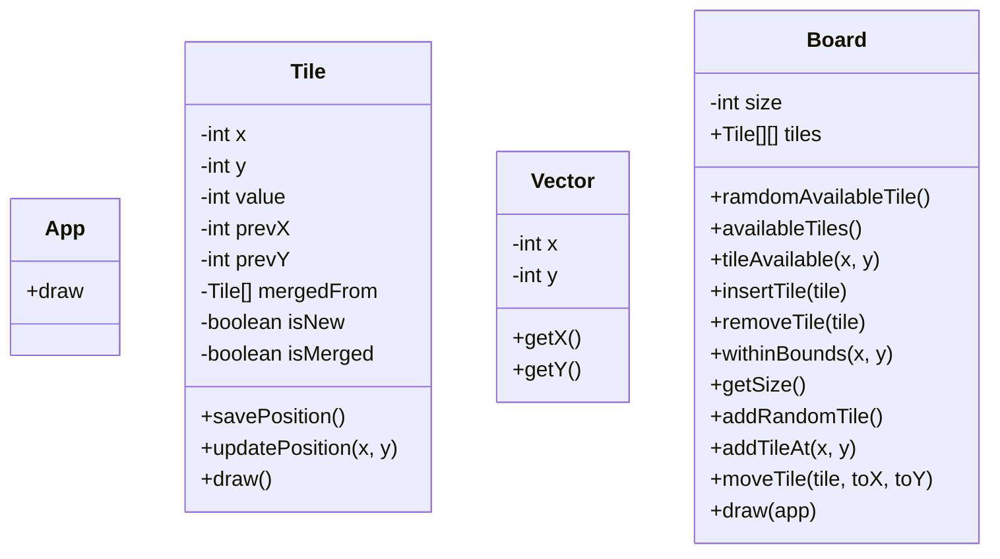

# 2048

Simple game 2048 written in Java for practice.

## Prerequisites

- Java Development Kit (JDK) version 11 or later
- Gradle version 8.0 or later

## How to run

1. Clone the repository

2. Build the project using Gradle

```bash
gradle build
```

3. Run the application

```bash
gradle run
```

## How to play

The game is played by moving tiles with the arrow keys. The goal is to create a tile with a value that is a multiple of 2. When a tile is created, it will be added to the grid.

Press 'r' to restart the game.

Left click on a tile to spawn a new tile.

## Design

The game is designed to be simple and easy to understand.

